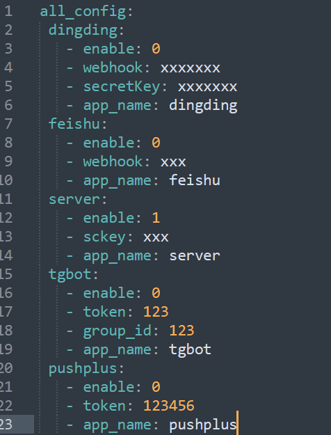
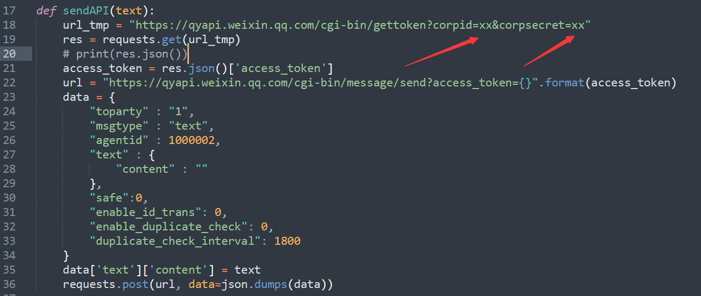
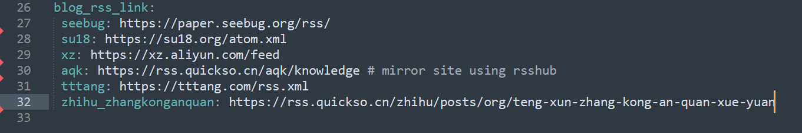
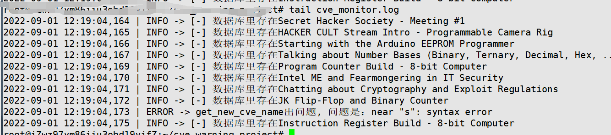
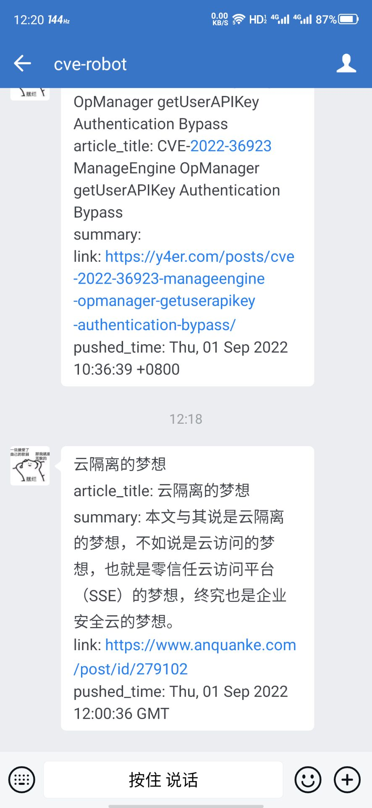

## Repo

主要是对安全咨询的获取，可以通过RSS获取爬虫的方式获取自己感兴趣的消息，cve或者新的技术文章等等

## Usage

1. 下载项目

2. 安装相关的依赖

   ```bash
   pip install -r requirements.txt
   # 爬虫相关
   1. 安装Chrome浏览器
   2. 安装浏览器相近版本的驱动 https://chromedriver.storage.googleapis.com/index.html
   ··google-chrome --version
   ··chromedriver -v
   ```

3. 配置相关文件
   在config.yaml中支持多种方法发送消息
   

   选择一种将其enable项置为`1`，且填上需要的key获取token

   值得**注意**的是，因为这里的Server酱在使用的时候有限制(当然你是氪金佬当我没说)，我将企业微信的相关接口封装成了`Util.py`中的`sendAPI`方法

   所以同样选用企业微信的方式的小伙伴需要在server中enable为1，且配置sendAPI方法认证凭证
   

   当然，如果你选择的是其他发送方法，也需要稍作修改sendAPI，因为我之后都是使用的Util.sendAPI接口进行消息的发送(懒癌犯了，不想优化一下了，能用就行)

4. 特定资讯配置

   这里采用了两种方式进行获取，首选RSS方式

   直接在config.yaml中添加对应的RSS链接

   

   另一种就是目的站点不存在RSS的使用，我们就需要通过爬虫的方式获取

   项目中已经有了一个`huayunan.py`的实例，直接稍作修改XPATH语句就能够添加没有RSS的站点

5. 运行项目

   我们将项目运行在vps上面
   可以使用tmux/screen/nohup等等后台工具

   ```bash
   nohup python3 main.py > /dev/null 2>&1 &
   ```

   
   
   